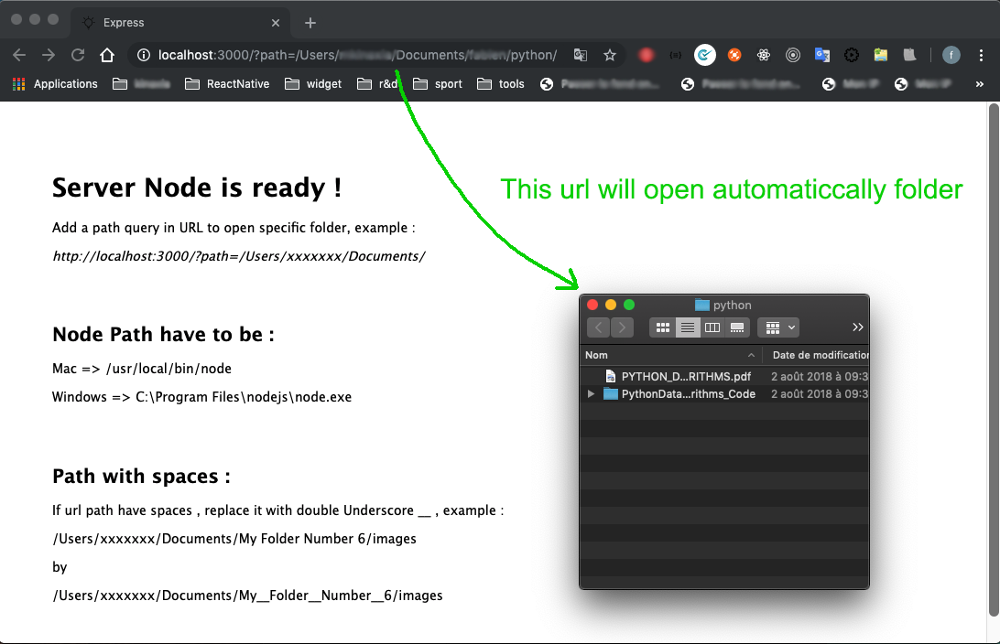

### Electron Open Folder From Navigator

- This application Electron allows to open a specific folder from any browser from a browser, by not a path parameter in the url.





####How to run
                
1. Clone the code repository.
2. Open terminal to code repository.
3. Make sure Node path is : Mac => /usr/local/bin/node or Windows => C:\Program Files\nodejs\node.exe
4. Run 
```javascript
npm install
```
5. Run 
```javascript
npm start
```
6. Open url : http://localhost:3000/
7. Add specific path in "path" querry like :
http://localhost:3000/?path=/Users/xxxxxxx/Documents/

The specific folder should be open automaticcaly


####Build the app
                
1. Mac : 
```javascript
npm run package-mac
```
2. Windows : 
```javascript
electron-packager . app --platform=win32 --arch x64 --out dist/
```


